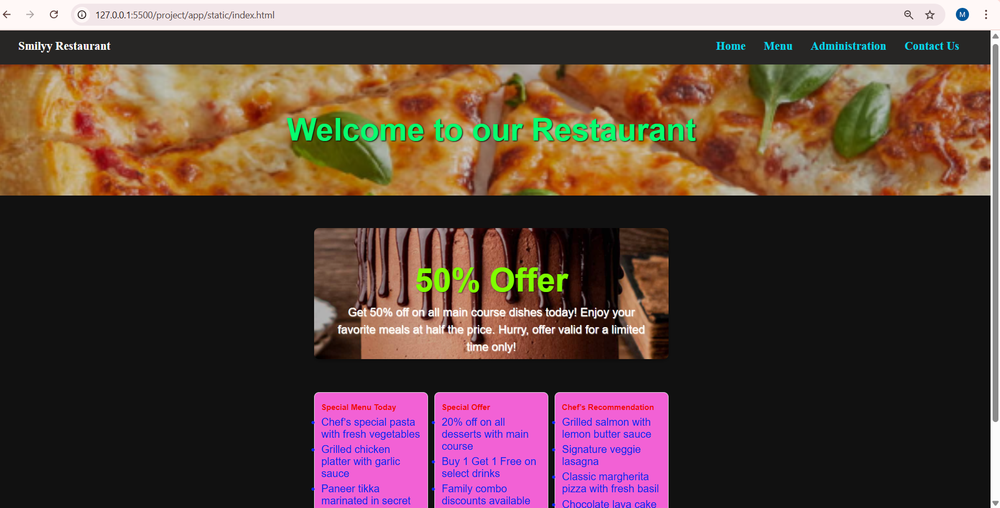
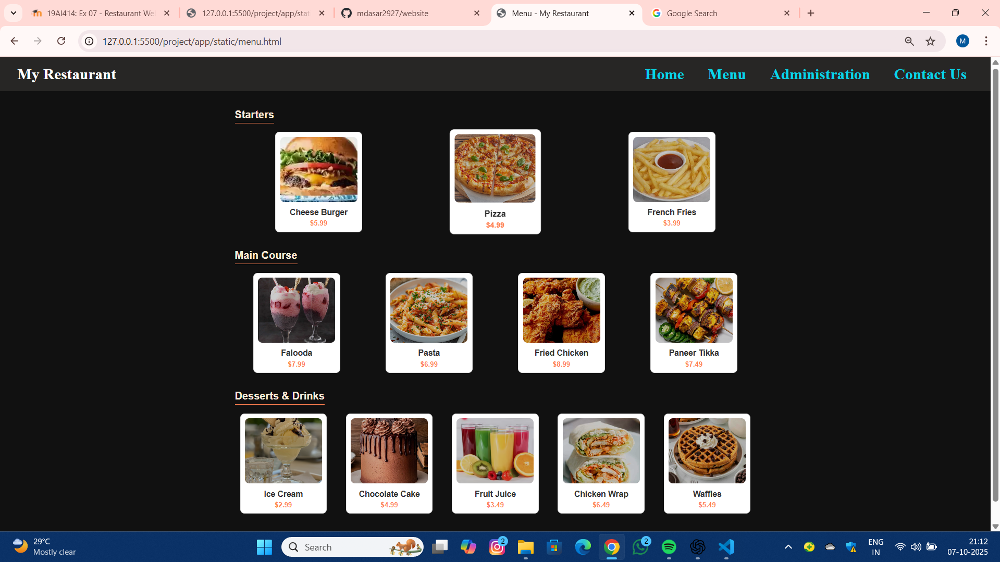
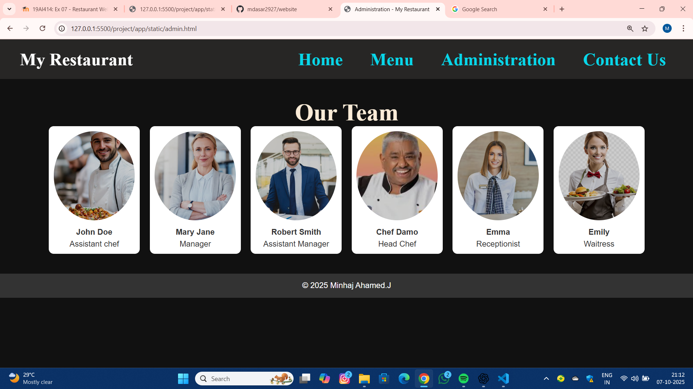
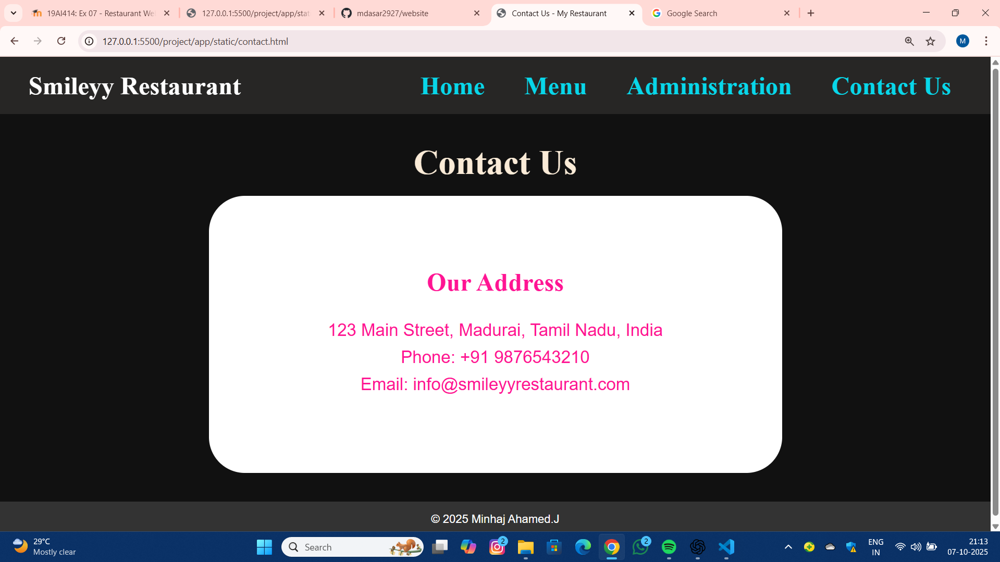

# Ex.07 Restaurant Website
# Date:
# AIM:
To develop a static Restaurant website to display the food items and services provided by them.

# DESIGN STEPS:
## Step 1:
Requirement collection.

## Step 2:
Creating the layout using HTML and CSS.

## Step 3:
Updating the sample content.

## Step 4:
Choose the appropriate style and color scheme.

## Step 5:
Validate the layout in various browsers.

## Step 6:
Validate the HTML code.

## Step 7:
Publish the website in the given URL.

# PROGRAM:
```
index.html:

<!DOCTYPE html>
<html lang="en">
<head>
    <meta charset="UTF-8">
    <title>Home - My Restaurant</title>
    <link rel="stylesheet" href="style.css">
</head>
<body>

<header>
<header>
    <h1 class="h1">Smilyy Restaurant</h1> <!-- Left corner -->
    <nav>
        <a href="index.html">Home</a>
        <a href="menu.html">Menu</a>
        <a href="admin.html">Administration</a>
        <a href="contact.html">Contact Us</a>
    </nav> <!-- Right corner -->
</header>

</header>

<div class="banner">
   <h1> Welcome to our Restaurant</h1>
</div>

<div class="container">
     <div class="container">
    <!-- Promotional Box -->
    <div class="promo-box">
        <h2>50% Offer</h2>
        <p>Get 50% off on all main course dishes today! Enjoy your favorite meals at half the price. Hurry, offer valid for a limited time only!</p>
    </div>

    <!-- Features Section -->
<!-- Features Section -->
<div class="features">

    <div class="feature-box">
        <h3>Special Menu Today</h3>
        <ul>
            <li>Chef’s special pasta with fresh vegetables</li>
            <li>Grilled chicken platter with garlic sauce</li>
            <li>Paneer tikka marinated in secret spices</li>
            <li>Freshly baked garlic bread</li>
        </ul>
    </div>

    <div class="feature-box">
        <h3>Special Offer</h3>
        <ul>
            <li>20% off on all desserts with main course</li>
            <li>Buy 1 Get 1 Free on select drinks</li>
            <li>Family combo discounts available</li>
            <li>Limited time weekday offers</li>
        </ul>
    </div>

    <div class="feature-box">
        <h3>Chef’s Recommendation</h3>
        <ul>
            <li>Grilled salmon with lemon butter sauce</li>
            <li>Signature veggie lasagna</li>
            <li>Classic margherita pizza with fresh basil</li>
            <li>Chocolate lava cake for dessert lovers</li>
        </ul>
    </div>

</div>


<footer>
    &copy; 2025 Minhaj Ahamed.J
</footer>

</body>
</html>

menu.html:

<!DOCTYPE html>
<html lang="en">
<head>
    <meta charset="UTF-8">
    <title>Menu - My Restaurant</title>
    <link rel="stylesheet" href="style.css">
</head>
<body>

<header>
    <h1>My Restaurant</h1>
    <nav>
        <a href="index.html">Home</a>
        <a href="menu.html">Menu</a>
        <a href="admin.html">Administration</a>
        <a href="contact.html">Contact Us</a>
    </nav>
</header>

<div class="container">

    <!-- Starters Section -->
    <div class="menu-section">
        <h2>Starters</h2>
        <div class="menu-grid">
            <div class="menu-item">
                
                <h3>Cheese Burger</h3>
                <p>$5.99</p>
            </div>
            <div class="menu-item">
                
                <h3>Pizza</h3>
                <p>$4.99</p>
            </div>
            <div class="menu-item">
                
                <h3>French Fries</h3>
                <p>$3.99</p>
            </div>
        </div>
    </div>

    <!-- Main Course Section -->
    <div class="menu-section">
        <h2>Main Course</h2>
        <div class="menu-grid">
            <div class="menu-item">
                
                <h3>Falooda</h3>
                <p>$7.99</p>
            </div>
            <div class="menu-item">
                
                <h3>Pasta</h3>
                <p>$6.99</p>
            </div>
            <div class="menu-item">
                
                <h3>Fried Chicken</h3>
                <p>$8.99</p>
            </div>
            <div class="menu-item">
                
                <h3>Paneer Tikka</h3>
                <p>$7.49</p>
            </div>
        </div>
    </div>

    <!-- Desserts & Drinks Section -->
    <div class="menu-section">
        <h2>Desserts & Drinks</h2>
        <div class="menu-grid">
            <div class="menu-item">
                
                <h3>Ice Cream</h3>
                <p>$2.99</p>
            </div>
            <div class="menu-item">
                
                <h3>Chocolate Cake</h3>
                <p>$4.99</p>
            </div>
            <div class="menu-item">
                
                <h3>Fruit Juice</h3>
                <p>$3.49</p>
            </div>
            <div class="menu-item">
                
                <h3>Chicken Wrap</h3>
                <p>$6.49</p>
            </div>
            <div class="menu-item">
                
                <h3>Waffles</h3>
                <p>$5.49</p>
            </div>
        </div>
    </div>

</div>

<footer>
    &copy; 2025 Minhaj Ahamed.J
</footer>

</body>
</html>

admin.html:

<!DOCTYPE html>
<html lang="en">
<head>
    <meta charset="UTF-8">
    <title>Administration - My Restaurant</title>
    <link rel="stylesheet" href="style.css">
</head>
<body>

<header>
    <h1>My Restaurant</h1>
    <nav>
        <a href="index.html">Home</a>
        <a href="menu.html">Menu</a>
        <a href="admin.html">Administration</a>
        <a href="contact.html">Contact Us</a>
    </nav>
</header>

<div class="container">
    <h1>Our Team</h1>
    <div class="admin-grid">
        <div class="admin-card">
            
            <h4>John Doe</h4>
            <p>Assistant chef</p>
        </div>
        <div class="admin-card">
            
            <h4>Mary Jane</h4>
            <p>Manager</p>
        </div>
        <div class="admin-card">
            
            <h4>Robert Smith</h4>
            <p>Assistant Manager</p>
        </div>
        <div class="admin-card">
            
            <h4>Chef Damo</h4>
            <p>Head Chef</p>
        </div>
        <div class="admin-card">
            
            <h4>Emma</h4>
            <p>Receptionist</p>
        </div>
        <div class="admin-card">
            
            <h4>Emily</h4>
            <p>Waitress</p>
        </div>
    </div>
</div>

<footer>
    &copy; 2025 Minhaj Ahamed.J
</footer>

</body>
</html>

contact.html:


<!DOCTYPE html>
<html lang="en">
<head>
    <meta charset="UTF-8">
    <title>Contact Us - My Restaurant</title>
    <link rel="stylesheet" href="style.css">
</head>
<body>

<header>
    <h1>Smileyy Restaurant</h1>
    <nav>
        <a href="index.html">Home</a>
        <a href="menu.html">Menu</a>
        <a href="admin.html">Administration</a>
        <a href="contact.html">Contact Us</a>
    </nav>
</header>

<div class="container">
    <h1>Contact Us</h1><br>
    <div class="contact-info">
        <h1>Our Address</h1><br>
        <p>123 Main Street, Madurai, Tamil Nadu, India</p>
        <p>Phone: +91 9876543210</p>
        <p>Email: info@smileyyrestaurant.com</p>
    </div>
</div>

<footer>
    &copy; 2025 Minhaj Ahamed.J
</footer>

</body>
</html>

style.css:

/* Menu page section */
.menu-section {
    margin-bottom: 40px;
}

.menu-section h2 {
    border-bottom: 2px solid #ff7f50;
    display: inline-block;
    padding-bottom: 5px;
    margin-bottom: 20px;
    color: antiquewhite;
}

.menu-section .menu-grid {
    display: flex;
    flex-wrap: wrap;
    gap: 20px;
    justify-content: space-around;
}

.menu-item {
    width: 200px;
    border: 1px solid #ddd;
    border-radius: 10px;
    background: white;
    text-align: center;
    padding: 10px;
    transition: transform 0.2s;
}

.menu-item:hover {
    transform: scale(1.05);
}

.menu-item img {
    width: 100%;
    height: 150px;
    object-fit: cover;
    border-radius: 10px;
}

.menu-item h3 {
    margin: 10px 0 5px;
}

.menu-item p {
    color: #ff7f50;
    font-weight: bold;
}
* {
    margin: 0;
    padding: 0;
    box-sizing: border-box;
    font-family: Arial, sans-serif;
}

/* Body & banner */
body {
    background-color: #111111;
    color: #333;
}

header {
    background-color: #ff7f50; /* soft orange */
    padding: 20px 0;
    text-align: center;
    color: white;
}

header nav a {
    color: white;
    text-decoration: none;
    margin: 0 15px;
    font-weight: bold;
    font-size: 18px;
}

header nav a:hover {
    text-decoration: underline;
}

/* Banner image */
.banner {
    width: 100%;
    height: 400px;
    background: url('pizza.png') center/cover no-repeat;
    display: flex;
    align-items: center;
    justify-content: center;
    color: white;
    font-size: 48px;
    font-weight: bold;
    text-shadow: 2px 2px 4px #000;
}
.banner h1{
  color: rgb(7, 254, 110);
}

/* Container */
.container {
    width: 90%;
    max-width: 1200px;
    margin: 40px auto;
}
.container h1{
  color: antiquewhite;
  text-align: center;
  font-size: 3.0rem;
  font-family:'Times New Roman', Times, serif
}
.admin-grid {
    display: grid;
    grid-template-columns: repeat(auto-fill, minmax(180px, 1fr));
    gap: 20px;
}

.admin-card {
    background: white;
    text-align: center;
    padding: 10px;
    border-radius: 10px;
    box-shadow: 0 0 10px rgba(0,0,0,0.1);
}

.admin-card img {
    width: 100%;
    height: 180px;
    object-fit: cover;
    border-radius: 50%;
    margin-bottom: 10px;
}

.admin-card h4 {
    margin-bottom: 5px;
}
.contact-info {
    background: white;
    padding: 100px;
    border-radius: 50px;
    width: 100%;
    max-width: 800px;
    margin: auto;
    text-align: center;
}

.contact-info h1 {
    margin-bottom: 15px;
    font-size: 2.2rem;
    color: deeppink;
}

.contact-info p {
    margin-bottom: 10px;
    text-align: center;
    font-size: 1.5rem;
    color:deeppink;
}
footer {
    background-color: #333;
    color: white;
    text-align: center;
    padding: 15px;
    margin-top: 40px;
}
/* Home page feature boxes */
.features {
    display: flex;
    justify-content: space-between; /* Spread boxes across the row */
    flex-wrap: wrap; /* Allow wrapping on smaller screens */
    gap: 20px;
    margin: 40px 0;
}

.feature-box {
    flex: 1; /* Each box takes equal width */
    min-width: 300px; /* Minimum width for small screens */
    max-width: 400px; /* Maximum width for large screens */
    background: rgb(242, 97, 213);
    border: 1px solid #ddd;
    border-radius: 15px;
    padding: 30px 20px; /* Bigger padding for bigger box */
    text-align: left; /* Text aligned left */
    box-shadow: 0 6px 12px rgba(0,0,0,0.15);
    transition: transform 0.3s;
}

.feature-box:hover {
    transform: translateY(-5px);
}

.feature-box h3 {
    color: #f00d0d;
    margin-bottom: 15px;
    font-size: 1.5rem; /* Bigger heading */
}

.feature-box ul li {
    margin-bottom: 10px;
    color: #0b26ee;
    font-size: 2.0rem;
}


/* Promotional Box on Home Page */
.promo-box {
    background: url('cake.png') center/cover no-repeat;
    color: rgb(8, 7, 7);
    padding: 100px 50px;
    border-radius: 15px;
    text-align: center;
    margin: 100px 0;
    box-shadow: 0 4px 10px rgba(0,0,0,0.3);
    width: 100%;
    height: 400px;
}

.promo-box h2 {
    font-size: 100px;
    font-weight: bold;
    margin-bottom: 15px;
    text-shadow: 2px 2px 4px rgba(0,0,0,0.6);
    color: chartreuse;
}

.promo-box p {
    font-size: 2.2rem;
    line-height: 1.5;
    text-shadow: 1px 1px 3px rgb(252, 255, 250);
    color: #fdf7f0;
}
.heading{
  font-size: 5.5rem;
  font-family: 'Franklin Gothic Medium', 'Arial Narrow', Arial, sans-serif;
}
.link{
  font-size: 2.2rem;
  font-family: Verdana, Geneva, Tahoma, sans-serif;
}
/* Header styling */
header {
    width: 100%;
    background-color: #272625; /* Soft orange */
    display: flex;
    justify-content: space-between; /* Left-right */
    align-items: center; /* Vertical center */
    padding: 15px 40px;
    box-sizing: border-box;
}

/* Restaurant name */
header h1 {
    margin: 0; /* Remove default margin */
    font-size: 2.2rem;
    font-family: 'Times New Roman', Times, serif;
}

/* Navigation links */
header nav {
    display: flex;
    align-items: center; /* Ensure vertical alignment */
    gap: 25px; /* Space between links */
    
}

header nav a {
    color: rgb(8, 214, 233);
    text-decoration: none;
    font-size: 2.2rem;
    font-weight: bold;
    padding: 5px 0; /* Optional padding to align vertically */
    font-family: 'Times New Roman', Times, serif;
}

header nav a:hover {
    text-decoration: underline;
}

```

# OUTPUT:





# RESULT:
The program for designing software company website using HTML and CSS is completed successfully.
